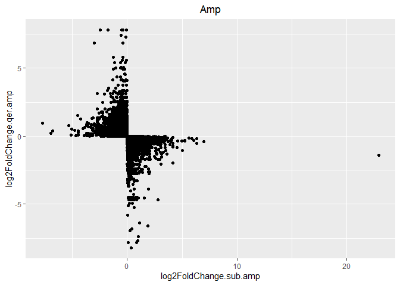

Some_statistics
================
Jeronimo Miranda
2023-11-01

## Length distribution of transcripts

This is an R Markdown document. Markdown is a simple formatting syntax
for authoring HTML, PDF, and MS Word documents. For more details on
using R Markdown see <http://rmarkdown.rstudio.com>.

When you click the **Knit** button a document will be generated that
includes both content as well as the output of any embedded R code
chunks within the document. You can embed an R code chunk like this:

``` r
select(ampirr, total_length.qer, total_length.target) %>% transmute(Protein_coding_mRNAs = total_length.qer, Antisense_Transcripts = total_length.target) %>% summary()
```

    ##  Protein_coding_mRNAs Antisense_Transcripts
    ##  Min.   :  201        Min.   :  197.0      
    ##  1st Qu.:  453        1st Qu.:  291.0      
    ##  Median : 1102        Median :  413.0      
    ##  Mean   : 1828        Mean   :  722.2      
    ##  3rd Qu.: 2603        3rd Qu.:  731.0      
    ##  Max.   :20424        Max.   :16451.0

We can see that through all quartiles, Protein coding mRNAs are longer
than antisense Transcripts, with the median protein coding mRNA being
1kb while half of antisense transcripts are shorter than 413 nucleotides
(this is after already filtering all non coding RNAs shorter than 200
bp)

``` r
#pivot to longer dataframe
ampirr %>% transmute(qseqid, sseqid, Protein_coding_mRNAs = total_length.qer, Antisense_Transcripts = total_length.target) %>% 
  pivot_longer(cols = Protein_coding_mRNAs:Antisense_Transcripts, names_to = "mRNA_type", values_to = "mRNA_length") %>% 
  #This operation is to chose the transcript id from the two seqid columns
  transmute(transcript_id = if_else(mRNA_type == "Protein_coding_mRNAs", qseqid, sseqid), mRNA_type, mRNA_length) %>% unique() %>% 
  #now you can plot
  ggplot(aes(x = mRNA_length)) + geom_histogram(binwidth = 200) + scale_x_continuous(n.breaks = 10) + xlim(c(0,16500)) + theme_bw() + facet_wrap(~mRNA_type, nrow = 2, scales = "free_y") + labs(x = "mRNA length [nucleotides]", title = "Antisense transcripts are generally shorter than their targets, but more numerous", subtitle = "Histogram distribution of transcript length")
```

<!-- -->
\## Comparison in mRNA transcript levels with their Antisense
counterpart

``` r
filter(qer_sub_diff, (log2FoldChange.qer.amp * log2FoldChange.sub.amp) < 0) %>% ggplot(aes(x = log2FoldChange.sub.amp, y = log2FoldChange.qer.amp)) + geom_point() + labs(title = "Amp") + theme(plot.title = element_text(hjust = 0.5))
```

<!-- -->
