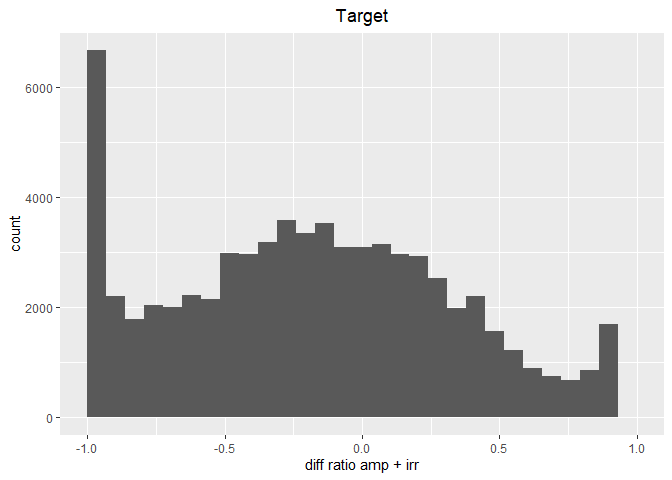
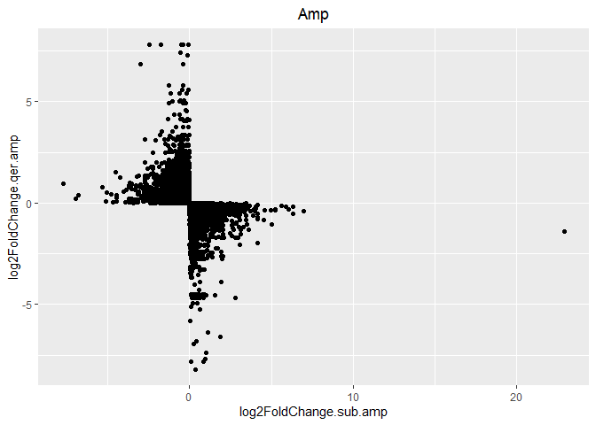
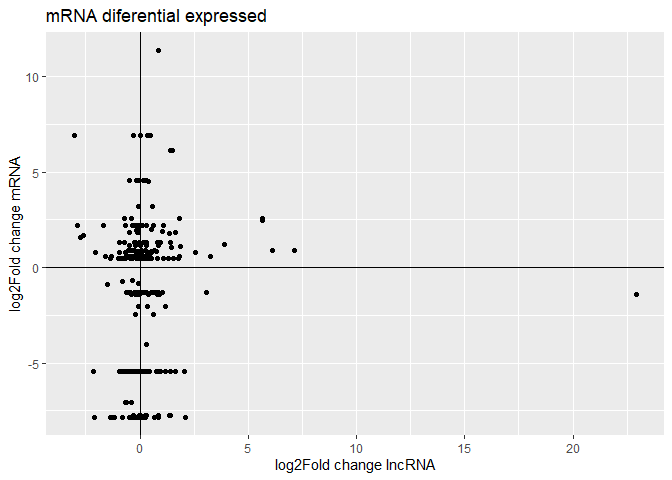
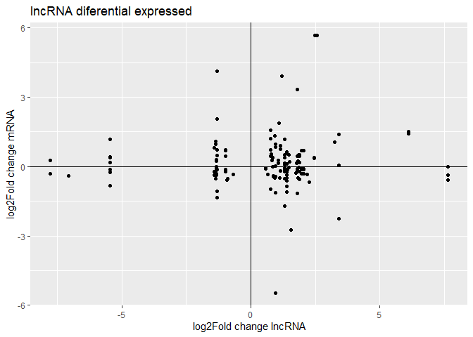
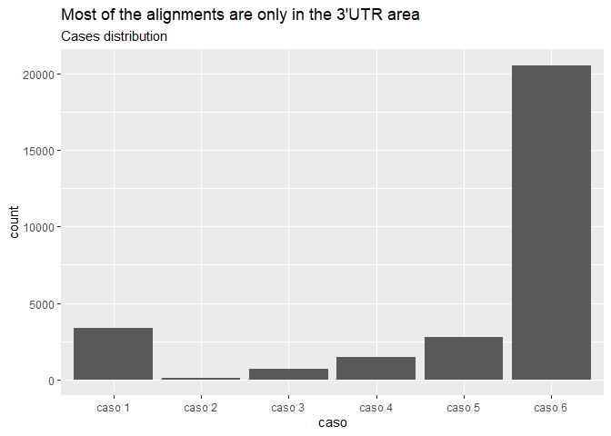
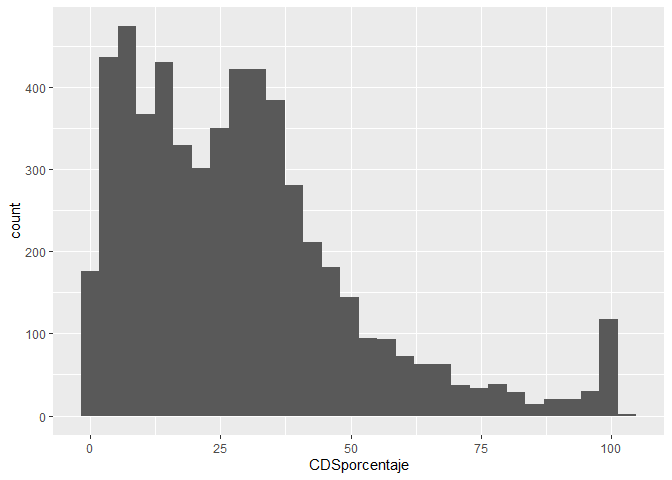
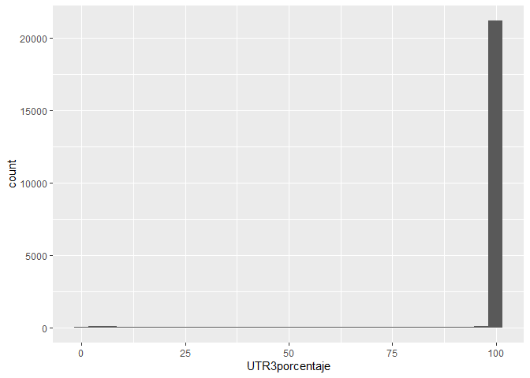

lncRNA
================
Bruno
2023-10-12

Libraries

You can check some preliminary analysis and summary statistics
[here](./SomeStatistics.md)

## DIF Ratio

Histograms showing the diff-ratios of query (mRNA) and target (lncRNA)
in both amputated/irradiated conditions.

The high proportion of minus-sense reads suggests accurate transcript
assembly **Opciones de conclusiones** 1.-The predominance of minus-sense
reads strengthens the belief that the assembled transcripts are faithful
representations of the original molecules.

2.-The substantial proportion of minus-sense reads strongly supports the
conclusion that the assembled transcripts accurately represent the
parental molecules.

3.-Finding mostly minus-sense reads increases our confidence that the
assembled transcripts are indeed correctly assembled

4.-(La mayoría de lecturas están en el sentido negativo, lo cual da
fiabilidad a que los transcritos que se ensamblaron en el sentido
correcto.)

``` r
#Histogram of the ratio of reads on the positive and the negative strand (ideal is -1)
ggplot(data = ampirr, aes(x = diff_ratio_ampirr.qer)) + geom_histogram() + 
  labs(x = "Difference ratio of reads", title = "Query mRNAs show the expected predominance of minus strand reads", subtitle = "Difference ratio taking into account both experiments", y = "Number of transcripts") + theme(plot.title = element_text(hjust = 0.5)) + xlim(-1,1)
```

    ## `stat_bin()` using `bins = 30`. Pick better value with `binwidth`.

    ## Warning: Removed 2182 rows containing non-finite values (`stat_bin()`).

    ## Warning: Removed 2 rows containing missing values (`geom_bar()`).

<!-- -->

``` r
ggplot(data = ampirr, aes(x = diff_ratio_ampirr.target)) + geom_histogram() + 
  labs(x = "Difference ratio of reads", title = "Antisense mRNAs show an even distribution of read strand", subtitle = "Difference ratio taking into account both experiments", y = "Number of transcripts") + theme(plot.title = element_text(hjust = 0.5)) + xlim(-1,1)
```

    ## `stat_bin()` using `bins = 30`. Pick better value with `binwidth`.

    ## Warning: Removed 8510 rows containing non-finite values (`stat_bin()`).
    ## Removed 2 rows containing missing values (`geom_bar()`).

<!-- -->

Expresión diferencial para las condiciones de amputación y radiación

\#Padj significativa en los 4 cuadrantes con todos los datos

SelfBlast is a data frame that shows the alignment of a query transcript
(mRNA) with a subject transcript (lncRNA). BLAST identifies some queries
(mRNA) that have alignments with more than one subject (lncRNA).
SelfBlast has 9,930 unique query (mRNA) transcript IDs.

Data frames based on SelfBlast and adding log2FoldChange and Padj
columns. From the 80,000 entries, we kept only the with the entries padj
\< 0.05.

\##Irradiated

\###mRNA (Query)

Filtering Padj \< 0.05 for mRNA/query

── Data Summary ──────────────────────── Values  
Number of rows **223**  
Number of columns 10  
── Variable type: character
────────────────────────────────────────────────────────────────────
skim_variable n_unique 1 qseqid 25 2 sseqid 217

── Variable type: numeric
──────────────────────────────────────────────────────────────────────
skim_variable n_missing complete_rate mean sd p0 p25 p50 5
log2FoldChange.qer.irr 0 1 -1.22 4.51 -2.33e+ 1 -5.54 -1.11  
6 padj.qer.irr 0 1 0.0180 0.0159 3.79e-10 0.00434 0.0190 7
log2FoldChange.sub.irr 8 0.964 0.0538 0.983 -3.49e+ 0 -0.469 0.112 8
padj.sub.irr 113 0.493 0.994 0.0442 5.52e- 1 1.00 1.00

Filtering with Padj \< 0.05 for mRNA/query, we have a total of 223
entries. Of these entries, 113 rows contain NAs in the subject Padj
column (only the 49% of the entries have a value) and 8 NAs in the
log2FoldChange subject column.

``` r
#Script para el skim
#filter(mrna_deg, padj.qer.irr < 0.05) %>% skim_without_charts()
filter(mrna_deg, padj.qer.irr < 0.05) %>%
  ggplot(aes(x = log2FoldChange.sub.irr, y = log2FoldChange.qer.irr)) +
  geom_point() +
  geom_hline(yintercept = 0) +
  geom_vline(xintercept = 0) +
labs(title = "mRNA diferential expressed when lncRNA not under Irradiation condition",
     x = "log2Fold change lncRNA",
     y = "log2Fold change mRNA")#, color = "red", linetype = "dashed" <- linea punteada)
```

    ## Warning: Removed 8 rows containing missing values (`geom_point()`).

<!-- -->

Reminder that BLAST identified that some mRNA (query) transcripts align
with more than one lncRNA (subject), hence the reason we observe many
dots at the same level on the Y-axis. In this graphic, we observed dots
where the mRNA (query) had significant DE (differential expression), but
the pair, lncRNA/subject, did not. We might be interested in the mRNA
TRINITY_DN5414_c2_g1_i3 that has a log2FoldChange of -23.261. We
observed that TRINITY_DN5414_c2_g1_i3 aligns with 3 different lncRNAs.

PS: Notice how the axis X goes from -3 to 3, which means that the
lncRNAs barely change and it wasn’t significant.

\###lncRNA (Subject) Filtering Padj \< 0.05 for subject/lncRNA

── Data Summary ──────────────────────── Values  
Name Piped data Number of rows 101  
Number of columns 10

── Variable type: character
────────────────────────────────────────────────────────────────────
skim_variable n_unique 1 qseqid 88 2 sseqid 28

── Variable type: numeric
──────────────────────────────────────────────────────────────────────
skim_variable n_missing complete_rate mean sd p0 p25 p50 5
log2FoldChange.qer.irr 2 0.980 0.371 1.22 -2.17e+ 0 -0.190 0.132 6
padj.qer.irr 32 0.683 0.974 0.111 3.88e- 1 1.00 1.00  
7 log2FoldChange.sub.irr 0 1 0.615 2.95 -6.94e+ 0 -1.16 1.04  
8 padj.sub.irr 0 1 0.0216 0.0183 1.77e-12 0.000579 0.0233

Filtering with Padj \< 0.05 for subject/lncRNA, we have a total of 101
entries. Of these entries, 32 rows contain NAs in the query Padj column
(the 68% of entries have a value) and 2 NAs in the log2FoldChange
subject column.

``` r
# script skim
#filter(mrna_deg, padj.sub.irr < 0.05) %>% skim_without_charts()
filter(mrna_deg, padj.sub.irr < 0.05) %>%
  ggplot(aes(x = log2FoldChange.sub.irr, y = log2FoldChange.qer.irr)) +
  geom_point() +
  geom_hline(yintercept = 0) +
  geom_vline(xintercept = 0) +
labs(title = "Expresion diferencial significativa en A",
     x = "log2Fold change lncRNA",
     y = "log2Fold change mRNA")
```

    ## Warning: Removed 2 rows containing missing values (`geom_point()`).

<!-- -->

On the other hand, here we observed cases when the lncRNA values show
significant differential expression, the log2FoldChange values for mRNA
do not. The log2FoldChange values for lncRNA range between -7 and 7.
Nonetheless, there could be some regulatory processes at play, as the
lncRNA is overexpressed or underexpressed while the mRNA remains
unchanged. Across these graphics, we may be particularly interested in
cases where one transcript exhibits differential expression while the
other does not.

\##Amputated

\###mRNA (query) Filtering Padj \< 0.05 for query/mRNA

── Data Summary ──────────────────────── Values  
Name Piped data Number of rows **293**  
Number of columns 10

── Variable type: character
────────────────────────────────────────────────────────────────────
skim_variable n_unique 1 qseqid 51 2 sseqid 268

── Variable type: numeric
──────────────────────────────────────────────────────────────────────
skim_variable n_missing complete_rate mean sd p0 p25 p50  
1 log2FoldChange.qer.amp 0 1 -0.897 4.03 -7.83e+ 0 -5.46 0.446  
2 padj.qer.amp 0 1 0.0135 0.0108 5.62e-22 0.00341 0.0139 3
log2FoldChange.sub.amp 11 0.962 0.225 1.76 -3.02e+ 0 -0.321 0.0135  
4 padj.sub.amp 76 0.741 0.835 0.211 2.40e- 5 0.759 0.933

A total of 293 entries, 11 rows with NA for log2FoldChange subject
column, and 76 NAs for padj.

``` r
#filter(mrna_deg, padj.qer.amp < 0.05) %>% skim_without_charts()

filter(mrna_deg, padj.qer.amp < 0.05) %>%
  ggplot(aes(x = log2FoldChange.sub.amp, y = log2FoldChange.qer.amp)) +
  geom_point() +
  geom_hline(yintercept = 0) +
  geom_vline(xintercept = 0)
```

    ## Warning: Removed 11 rows containing missing values (`geom_point()`).

<!-- -->

This graphic is interesting because we observe a log2FoldChange value of
22.9 for one lncRNA transcript, but there is no corresponding Padj
value. However, in this graphic, we are interested in the dots that have
non-zero values on the Y-axis and values close to zero on the X-axis.

\##lncRNA (subject) Filtering Padj \< 0.05 for subject/lncRNA

── Data Summary ──────────────────────── Values  
Name Piped data Number of rows **149**  
Number of columns 10

── Variable type: character
────────────────────────────────────────────────────────────────────
skim_variable n_unique 1 qseqid 134 2 sseqid 59

── Variable type: numeric
──────────────────────────────────────────────────────────────────────
skim_variable n_missing complete_rate mean sd p0 p25 p50 1
log2FoldChange.qer.amp 2 0.987 0.158 1.18 -5.46e+ 0 -0.351 -0.0539 2
padj.qer.amp 14 0.906 0.800 0.212 5.62e-22 0.663 0.893  
3 log2FoldChange.sub.amp 0 1 0.488 2.62 -7.77e+ 0 -0.984 1.22  
4 padj.sub.amp 0 1 0.0164 0.0171 1.58e-17 0.000330 0.00611

For this case, we have 149 entries and only 2 NAs for the log2FoldChange
query column and 14 for the padj query column.

``` r
filter(mrna_deg, padj.sub.amp < 0.05) %>%
  ggplot(aes(x = log2FoldChange.sub.amp, y = log2FoldChange.qer.amp)) +
  geom_point() +
  geom_hline(yintercept = 0) +
  geom_vline(xintercept = 0)
```

    ## Warning: Removed 2 rows containing missing values (`geom_point()`).

<!-- -->

Here we observe significant values for lncRNAs (subject). Our focus is
on the dots that exhibit non-zero values on the X-axis and values close
to zero on the Y-axis. This graphic includes lncRNAs for which BLAST
identified alignments with more than one mRNA.

\##Casos de Alinieamiento

Descripción de casos: caso 1 El alineamiento es solamente dentro del CDS
caso 2 El alineamiento es tan largo que cae en las 3 zonas (5UTR, CDS y
3UTR) caso 3 El alineamiento empieza en la zona 5UTR y termina dentro de
CDS caso 4 El alineamiento empieza en la zona de CDS y termina en 3UTR
caso 5 El alineamiento es solamente en la zona 5UTR caso 6 El
alineamiento es solamente en la zona 3UTR

``` r
prot %>% ggplot(aes(x = caso)) + geom_histogram(stat = "count") + labs(title = "La mayoría de alineamientos son solamente en la zona 3UTR" ,subtitle = "Distribución de casos")
```

<!-- -->

\#Código para histogramas Histogramas Cuando el alineamiento es en la
zona de CDS, la mayoría de alineamientos en la zona de CDS se alinea con
el 50% del

``` r
prot %>% filter(CDSporcentaje>0) %>%   ggplot(aes(x = CDSporcentaje)) + geom_histogram()
```

    ## `stat_bin()` using `bins = 30`. Pick better value with `binwidth`.

<!-- -->

Cuando el alineamiento es en la zona 3UTR, la gran mayoría de veces se
alinea con todo el largo del área 3UTR

``` r
prot %>% filter(UTR3porcentaje>0) %>%   ggplot(aes(x = UTR3porcentaje)) + geom_histogram()
```

    ## `stat_bin()` using `bins = 30`. Pick better value with `binwidth`.

<!-- -->

Cuando el alineamiento es en la zona 5UTR, la mayoría de veces el
alineamiento es en todo el largo del área 5UTR

``` r
prot %>% filter(UTR5porcentaje>0) %>%   ggplot(aes(x = UTR5porcentaje)) + geom_histogram()
```

    ## `stat_bin()` using `bins = 30`. Pick better value with `binwidth`.

<!-- -->

Correlación positiva para el caso 1 (el alineamiento es únicamente en la
zona CDS)

**ANOTACIONES PARA LOS CASOS**

**ANOTACIONES PARA DEG**

    Pearson's product-moment correlation

data: x$log2FoldChange.sub.amp and x$log2FoldChange.qer.amp t = 22.313,
df = 21331, p-value \< 2.2e-16 alternative hypothesis: true correlation
is greater than 0 95 percent confidence interval: 0.1400006 1.0000000
sample estimates: cor 0.1510244

\##Explicación sobre los DF

Descripción del trabajo

DF de expresión diferencial: -**results_full_amp_degs**
-**results_full_irr_degs**

DF resultados del blast con transcritos antisentido:
-**swissProt_self_blastAStranscripts**

DF con anotaciones de BLASTX, prot ID, prot corrds, BLASTP, ontología,
nombre de los genes, organismos en el que se encuentra, length, etc
-**dlaevis_assembly_uniprt**

Data frames creadas:

\-**ampirr**: 32 columnas, 79mil filas Tomando como base el DF
swissProt, se hizzo un left join de los DF de DEG. Además se hizo otro
left join con las longitudes

ampirr tiene 79mil entradas porque a veces un transcrito de query, hace
match con diferentes subjects. En total hay 9930 queries diferentes.

\-**Filtrados**:32 collumnas, 23mil filas.

Tomando como base el DF ampirr, se hizo un filtro para seleccionar a los
transcritos mayores a 300. El df filtrado contiene 23639 entradas, es
decir, se quedarón fuera 50mil datos aprox

\-**qer_sub_diff**:10 coulmnas, 23mil filas

tomando como base filtrados. Se hicieron left joins para agregar los
datos de log2FoldChange y padj para qseqid y sseqid de ambas condiciones
(amp y irr)

\-**medianos**: esta tabla tiene los 50mil datos que fueron excluidos en
el DF filtrados, es decir, aquí hay transcritos de entres 200 y 300
nucleotidos. -**diff_rati_olvidados**: al DF olvidados, se le agregó los
datos de log2FoldChange Gráficas con DEG de los olvidados con valores de
padj menores a 0.05

**prot**: Se seleccionó unicamente las columnas de trasncript_id y prot
coords del DF dlaevis_assembly_uniprt. Con código se separo prot coords
en dos columnas (prot_start y prot_end). Se eliminaron las filas con NA
en prot coord Se hizo un left join en prot con filtrados para agregar
los datos de “qseqid, sseqid, length, qstart, qend,sstart, send” Se
filtró para tener únicamente los datos en el que van en sentido Se
agregaron columnas con los datos de CDS_length y URT_3 Se hicieron las
columnas de los casos, porcentaje de zona cubierto, y porcentaje del lnc
en cada zona.
