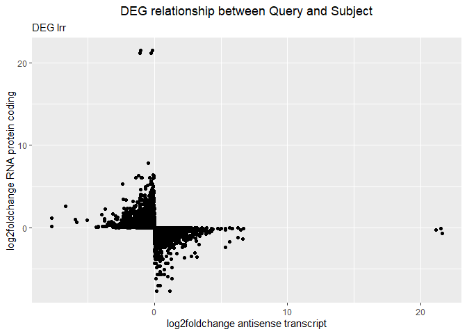
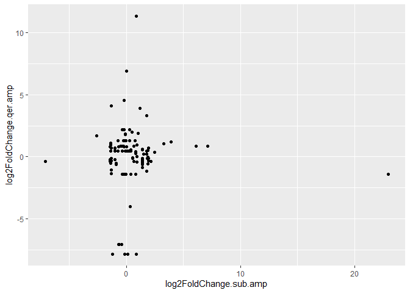

lncRNA
================
Bruno
2023-10-12

Librerias

``` r
library(dplyr)
library(tidyr)
library(forcats)
library(stringr)
library(ggplot2)
library(here)

directorio <- here()
source("scriptlncrna.R")
```

Histograma del dif-ratio de AMP e IRR sumados. En general hay una
tendencia a una actividad downregulation, particularmente para el Query.

``` r
ggplot(data = ampirr, aes(x = diff_ratio_ampirr.qer)) + geom_histogram() + labs(x = "diff ratio amp + irr", title = "Query") + theme(plot.title = element_text(hjust = 0.5)) + xlim(-1,1)
```

    ## `stat_bin()` using `bins = 30`. Pick better value with `binwidth`.

<!-- -->

``` r
ggplot(data = ampirr, aes(x = diff_ratio_ampirr.target)) + geom_histogram() + labs(x = "diff ratio amp + irr", title = "Target") + theme(plot.title = element_text(hjust = 0.5)) + xlim(-1,1)
```

    ## `stat_bin()` using `bins = 30`. Pick better value with `binwidth`.

<!-- -->

Gráfica de puntos donde se ve la relacion de down y up regulation entre
el Query y el Subject para cada condición ,AMP e IRR, filtrando los
puntos que generan upregulation en uno y downregulation en otro. En
general se aprecia que algunos transcritos tienen mucha influencia en su
contra parte, ya sea que el upregulation del Query provoque
downregulation en Subject o visceversa, hay algunos transcritos
particularmente interesantes por su alta up o down regulation.

``` r
#amp
filter(qer_sub_diff, (log2FoldChange.qer.amp * log2FoldChange.sub.amp) < 0) %>% ggplot(aes(x = log2FoldChange.sub.amp, y = log2FoldChange.qer.amp)) + geom_point() + labs(title = "Amp") + theme(plot.title = element_text(hjust = 0.5))
```

<!-- -->

``` r
#irr
filter(qer_sub_diff, (log2FoldChange.qer.irr * log2FoldChange.sub.irr) < 0) %>% ggplot(aes(x = log2FoldChange.sub.irr, y = log2FoldChange.qer.irr)) + geom_point() + labs(title = "Irr") + theme(plot.title = element_text(hjust = 0.5))
```

<!-- --> Gráficas

``` r
prot %>% group_by(qseqid) %>% summarise(No = n(), total = unique(total_length)) %>% ggplot(aes(x = No, y = total)) + geom_point() + labs(title = "Grafica") + theme(plot.title = element_text(hjust = 0.5))
```

<!-- -->

``` r
prot %>% group_by(qseqid) %>% summarise(No = n(), total = unique(total_length)) %>% ggplot(aes(x = total, y = No)) + geom_point() + labs(title = "Grafica") + theme(plot.title = element_text(hjust = 0.5))
```

<!-- -->

``` r
prot %>% group_by(qseqid) %>% summarise(No = n(),suma = sum(length), total = unique(total_length)) %>% ggplot(aes(x = total, y = suma)) + geom_point() + labs(title = "Grafica") + theme(plot.title = element_text(hjust = 0.5))
```

<!-- -->

``` r
prot %>% group_by(qseqid) %>% summarise(No = n(),mean = mean(length), total = unique(total_length)) %>% ggplot(aes(x = total, y = mean)) + geom_point() + labs(title = "Grafica") + theme(plot.title = element_text(hjust = 0.5))
```

<!-- -->
