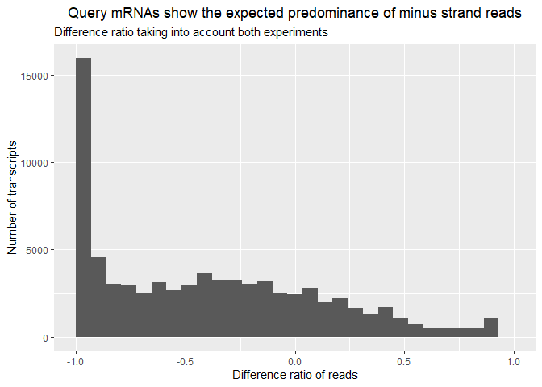
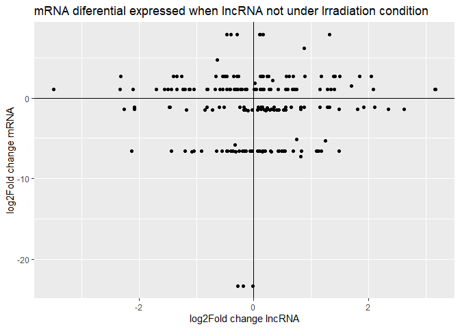

lncRNA
================
Bruno
2023-10-12

Librerias

``` r
library(dplyr)
```

    ## 
    ## Attaching package: 'dplyr'

    ## The following objects are masked from 'package:stats':
    ## 
    ##     filter, lag

    ## The following objects are masked from 'package:base':
    ## 
    ##     intersect, setdiff, setequal, union

``` r
library(tidyr)
library(forcats)
library(stringr)
library(ggplot2)
library(here)
```

    ## here() starts at C:/Users/cbzom/OneDrive/Documentos/Practica/lncRNA

``` r
directorio <- here()
source("scriptlncrna.R")
```

    ## Rows: 1108 Columns: 22

    ## ── Column specification ────────────────────────────────────────────────────────
    ## Delimiter: ","
    ## chr (13): transcript_id, log2FoldChange, padj, len, biom_id, gene_id, sprot_...
    ## num  (1): percent_id
    ## lgl  (8): RNAMMER, TmHMM, eggnog, Kegg, gene_ontology_BLASTX, gene_ontology_...
    ## 
    ## ℹ Use `spec()` to retrieve the full column specification for this data.
    ## ℹ Specify the column types or set `show_col_types = FALSE` to quiet this message.
    ## Rows: 408 Columns: 22
    ## ── Column specification ────────────────────────────────────────────────────────
    ## Delimiter: ","
    ## chr (13): transcript_id, log2FoldChange, padj, len, biom_id, X.gene_id, spro...
    ## num  (1): percen_id
    ## lgl  (8): RNAMMER, TmHMM, eggnog, Kegg, gene_ontology_BLASTX, gene_ontology_...
    ## 
    ## ℹ Use `spec()` to retrieve the full column specification for this data.
    ## ℹ Specify the column types or set `show_col_types = FALSE` to quiet this message.
    ## New names:
    ## Rows: 79530 Columns: 31
    ## ── Column specification ────────────────────────────────────────────────────────
    ## Delimiter: ","
    ## chr  (3): qseqid, sseqid, frames
    ## dbl (28): ...1, length, mismatch, pident, qstart, qend, sstart, send, evalue...
    ## 
    ## ℹ Use `spec()` to retrieve the full column specification for this data.
    ## ℹ Specify the column types or set `show_col_types = FALSE` to quiet this message.
    ## Rows: 79530 Columns: 12
    ## ── Column specification ────────────────────────────────────────────────────────
    ## Delimiter: "\t"
    ## chr (3): X1, X2, X6
    ## dbl (9): X3, X4, X5, X7, X8, X9, X10, X11, X12
    ## 
    ## ℹ Use `spec()` to retrieve the full column specification for this data.
    ## ℹ Specify the column types or set `show_col_types = FALSE` to quiet this message.
    ## Rows: 224804 Columns: 5
    ## ── Column specification ────────────────────────────────────────────────────────
    ## Delimiter: "\t"
    ## chr (1): #transcript
    ## dbl (4): plus_strand_1stReads, minus_strand_1stReads, total_reads, diff_ratio
    ## 
    ## ℹ Use `spec()` to retrieve the full column specification for this data.
    ## ℹ Specify the column types or set `show_col_types = FALSE` to quiet this message.
    ## Rows: 206854 Columns: 5
    ## ── Column specification ────────────────────────────────────────────────────────
    ## Delimiter: "\t"
    ## chr (1): #transcript
    ## dbl (4): plus_strand_1stReads, minus_strand_1stReads, total_reads, diff_ratio
    ## 
    ## ℹ Use `spec()` to retrieve the full column specification for this data.
    ## ℹ Specify the column types or set `show_col_types = FALSE` to quiet this message.
    ## New names:
    ## Rows: 464338 Columns: 8
    ## ── Column specification ────────────────────────────────────────────────────────
    ## Delimiter: ","
    ## chr (1): ...1
    ## dbl (7): baseMean, log2FoldChange, lfcSE, stat, pvalue, padj, ...8
    ## 
    ## ℹ Use `spec()` to retrieve the full column specification for this data.
    ## ℹ Specify the column types or set `show_col_types = FALSE` to quiet this message.
    ## New names:
    ## Rows: 464338 Columns: 8
    ## ── Column specification ────────────────────────────────────────────────────────
    ## Delimiter: ","
    ## chr (1): ...1
    ## dbl (7): baseMean, log2FoldChange, lfcSE, stat, pvalue, padj, ...8
    ## 
    ## ℹ Use `spec()` to retrieve the full column specification for this data.
    ## ℹ Specify the column types or set `show_col_types = FALSE` to quiet this message.
    ## Rows: 709054 Columns: 22
    ## ── Column specification ────────────────────────────────────────────────────────
    ## Delimiter: "\t"
    ## chr (21): swiss_prot_name, gene_id, transcript_id, sprot_Top_BLASTX_hit, pro...
    ## dbl  (1): length
    ## 
    ## ℹ Use `spec()` to retrieve the full column specification for this data.
    ## ℹ Specify the column types or set `show_col_types = FALSE` to quiet this message.
    ## 
    ## ── Column specification ────────────────────────────────────────────────────────
    ## cols(
    ##   X1 = col_character(),
    ##   X2 = col_double()
    ## )

Union de las columnas: plus, minus, total strands y diff ratio de AMP e
IRR con query y target Los histogramas son respecto al dif-ratio de la
suma de amp y irr para querry y target

``` r
ggplot(data = ampirr, aes(x = diff_ratio_ampirr.qer)) + geom_histogram() + labs(x = "diff ratio amp + irr", title = "Query") + theme(plot.title = element_text(hjust = 0.5)) + xlim(-1,1)
```

    ## `stat_bin()` using `bins = 30`. Pick better value with `binwidth`.

    ## Warning: Removed 2182 rows containing non-finite values (`stat_bin()`).

    ## Warning: Removed 2 rows containing missing values (`geom_bar()`).

<!-- -->

``` r
ggplot(data = ampirr, aes(x = diff_ratio_ampirr.target)) + geom_histogram() + labs(x = "diff ratio amp + irr", title = "Target") + theme(plot.title = element_text(hjust = 0.5)) + xlim(-1,1)
```

    ## `stat_bin()` using `bins = 30`. Pick better value with `binwidth`.

    ## Warning: Removed 8510 rows containing non-finite values (`stat_bin()`).
    ## Removed 2 rows containing missing values (`geom_bar()`).

<!-- -->

Expresion diferencial de

``` r
#amp
filter(qer_sub_diff, (log2FoldChange.qer.amp * log2FoldChange.sub.amp) < 0) %>% ggplot(aes(x = log2FoldChange.sub.amp, y = log2FoldChange.qer.amp)) + geom_point() + labs(title = "Amp") + theme(plot.title = element_text(hjust = 0.5))
```

<!-- -->

``` r
#irr
filter(qer_sub_diff, (log2FoldChange.qer.irr * log2FoldChange.sub.irr) < 0) %>% ggplot(aes(x = log2FoldChange.sub.irr, y = log2FoldChange.qer.irr)) + geom_point() + labs(title = "Irr") + theme(plot.title = element_text(hjust = 0.5))
```

<!-- -->
