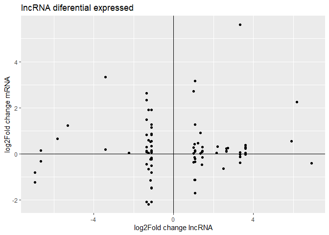

lncRNA
================
Bruno
2023-10-12

Libraries

You can check some preliminary analysis and summary statistics
[here](./SomeStatistics.md)

## DIF Ratio

Histograms showing the diff-ratios of query (mRNA) and target (lncRNA)
in both amputated/irradiated conditions.

The high proportion of minus-sense reads suggests accurate transcript
assembly

**Opciones de conclusiones**

1.-The predominance of minus-sense reads strengthens the belief that the
assembled transcripts are faithful representations of the original
molecules.

2.-The substantial proportion of minus-sense reads strongly supports the
conclusion that the assembled transcripts accurately represent the
parental molecules.

3.-Finding mostly minus-sense reads increases our confidence that the
assembled transcripts are indeed correctly assembled

4.-(La mayoría de lecturas están en el sentido negativo, lo cual da
fiabilidad a que los transcritos que se ensamblaron en el sentido
correcto.)

``` r
#Histogram of the ratio of reads on the positive and the negative strand (ideal is -1)
ggplot(data = ampirr, aes(x = diff_ratio_ampirr.qer)) + geom_histogram() + 
  labs(x = "Difference ratio of reads", title = "Query mRNAs show the expected predominance of minus strand reads", subtitle = "Difference ratio taking into account both experiments", y = "Number of transcripts") + theme(plot.title = element_text(hjust = 0.5)) + xlim(-1,1)
```

    ## `stat_bin()` using `bins = 30`. Pick better value with `binwidth`.

    ## Warning: Removed 2182 rows containing non-finite outside the scale range
    ## (`stat_bin()`).

    ## Warning: Removed 2 rows containing missing values or values outside the scale range
    ## (`geom_bar()`).

<!-- -->

``` r
ggplot(data = ampirr, aes(x = diff_ratio_ampirr.target)) + geom_histogram() + 
  labs(x = "Difference ratio of reads", title = "Antisense mRNAs show an even distribution of read strand", subtitle = "Difference ratio taking into account both experiments", y = "Number of transcripts") + theme(plot.title = element_text(hjust = 0.5)) + xlim(-1,1)
```

    ## `stat_bin()` using `bins = 30`. Pick better value with `binwidth`.

    ## Warning: Removed 8510 rows containing non-finite outside the scale range (`stat_bin()`).
    ## Removed 2 rows containing missing values or values outside the scale range
    ## (`geom_bar()`).

<!-- -->

Expresión diferencial para las condiciones de amputación y radiación

# Padj significativa en los 4 cuadrantes con todos los datos

SelfBlast is a data frame that shows the alignment of a query transcript
(mRNA) with a subject transcript (lncRNA). BLAST identifies some queries
(mRNA) that have alignments with more than one subject (lncRNA).
SelfBlast has 9,930 unique query (mRNA) transcript IDs.

The following data frames are based on SelfBlast plus the values of
log2FoldChange and Padj. From the 80,000 entries, we kept only the with
the entries padj \< 0.05.

## Irradiated

### mRNA (Query)

Filtering Padj \< 0.05 for mRNA/query

Number of rows: 223

| Variable           |  NA | complete_rate | unique |  mean |     p0 |   p25 |   p50 |
|:-------------------|----:|--------------:|-------:|------:|-------:|------:|------:|
| qseqid             |   0 |          1.00 |     25 |    NA |     NA |    NA |    NA |
| sseqid             |   0 |          1.00 |    217 |    NA |     NA |    NA |    NA |
| log2FoldChange.qer |   0 |          1.00 |     NA | -1.21 | -23.26 | -5.54 | -1.10 |
| padj.qer           |   0 |          1.00 |     NA |  0.01 |   0.00 | 0.004 |  0.01 |
| log2FoldChange.sub |   8 |          0.96 |     NA |  0.05 |  -3.48 | -0.46 |  0.11 |
| padj.sub           | 113 |          0.49 |     NA |  0.99 |   0.55 |  0.99 |  0.99 |

We have a total of 223 entries. Of these entries, 113 rows contain NAs
in the subject Padj column (only the 49% of the entries have a value)
and 8 NAs in the log2FoldChange subject column.

``` r
#Script para el skim
filter(mrna_deg, padj.qer.irr < 0.05) %>% skim_without_charts()
```

|                                                  |            |
|:-------------------------------------------------|:-----------|
| Name                                             | Piped data |
| Number of rows                                   | 223        |
| Number of columns                                | 10         |
| \_\_\_\_\_\_\_\_\_\_\_\_\_\_\_\_\_\_\_\_\_\_\_   |            |
| Column type frequency:                           |            |
| character                                        | 2          |
| numeric                                          | 8          |
| \_\_\_\_\_\_\_\_\_\_\_\_\_\_\_\_\_\_\_\_\_\_\_\_ |            |
| Group variables                                  | None       |

Data summary

**Variable type: character**

| skim_variable | n_missing | complete_rate | min | max | empty | n_unique | whitespace |
|:--------------|----------:|--------------:|----:|----:|------:|---------:|-----------:|
| qseqid        |         0 |             1 |  23 |  25 |     0 |       25 |          0 |
| sseqid        |         0 |             1 |  22 |  25 |     0 |      217 |          0 |

**Variable type: numeric**

| skim_variable          | n_missing | complete_rate |  mean |   sd |     p0 |   p25 |   p50 |  p75 | p100 |
|:-----------------------|----------:|--------------:|------:|-----:|-------:|------:|------:|-----:|-----:|
| log2FoldChange.qer.amp |         1 |          1.00 | -0.01 | 1.11 |  -2.92 | -0.43 |  0.03 | 0.07 | 8.10 |
| padj.qer.amp           |         4 |          0.98 |  0.87 | 0.17 |   0.14 |  0.82 |  0.92 | 0.98 | 1.00 |
| log2FoldChange.sub.amp |         8 |          0.96 | -0.16 | 0.93 |  -4.50 | -0.56 | -0.08 | 0.30 | 4.16 |
| padj.sub.amp           |        94 |          0.58 |  0.87 | 0.16 |   0.17 |  0.84 |  0.93 | 0.97 | 1.00 |
| log2FoldChange.qer.irr |         0 |          1.00 | -1.22 | 4.51 | -23.26 | -5.54 | -1.11 | 1.08 | 7.82 |
| padj.qer.irr           |         0 |          1.00 |  0.02 | 0.02 |   0.00 |  0.00 |  0.02 | 0.04 | 0.04 |
| log2FoldChange.sub.irr |         8 |          0.96 |  0.05 | 0.98 |  -3.49 | -0.47 |  0.11 | 0.56 | 3.17 |
| padj.sub.irr           |       113 |          0.49 |  0.99 | 0.04 |   0.55 |  1.00 |  1.00 | 1.00 | 1.00 |

``` r
filter(mrna_deg, padj.qer.irr < 0.05) %>%
  ggplot(aes(x = log2FoldChange.sub.irr, y = log2FoldChange.qer.irr)) +
  geom_point() +
  geom_hline(yintercept = 0) +
  geom_vline(xintercept = 0) +
labs(title = "mRNA diferential expressed when lncRNA not under Irradiation condition",
     x = "log2Fold change lncRNA",
     y = "log2Fold change mRNA")#, color = "red", linetype = "dashed" <- linea punteada)
```

    ## Warning: Removed 8 rows containing missing values or values outside the scale range
    ## (`geom_point()`).

<!-- -->

Reminder that BLAST identified that some mRNA (query) transcripts align
with more than one lncRNA (subject), hence the reason we observe many
dots at the same level on the Y-axis. In this graphic, we observed dots
where the mRNA (query) had significant DE (differential expression), but
the pair, lncRNA/subject, did not. We might be interested in the mRNA
TRINITY_DN5414_c2_g1_i3 that has a log2FoldChange of -23.261. We
observed that TRINITY_DN5414_c2_g1_i3 aligns with 3 different lncRNAs.

PS: Notice how the axis X goes from -3 to 3, which means that the
lncRNAs barely change and it wasn’t significant.

### lncRNA (Subject)

Filtering Padj \< 0.05 for subject/lncRNA

── Data Summary ──────────────────────── Values  
Name Piped data Number of rows 101  
Number of columns 10

| Variable           |  NA | complete_rate | n_unique | mean |    p0 |   p25 |  p50 |
|:-------------------|----:|--------------:|---------:|-----:|------:|------:|-----:|
| qseqid             |   0 |          1.00 |       88 |   NA |    NA |    NA |   NA |
| sseqid             |   0 |          1.00 |       28 |   NA |    NA |    NA |   NA |
| log2FoldChange.qer |   2 |          0.98 |       NA | 0.37 | -2.17 | -0.19 | 0.13 |
| padj.qer           |  32 |          0.68 |       NA | 0.97 |  0.38 |  0.99 | 0.99 |
| log2FoldChange.sub |   0 |          1.00 |       NA | 0.61 | -6.93 | -1.15 | 1.03 |
| padj.sub           |   0 |          1.00 |       NA | 0.02 |  0.00 |  0.00 | 0.02 |

Filtering with Padj \< 0.05 for subject/lncRNA, we have a total of 101
entries. Of these entries, 32 rows contain NAs in the query Padj column
(the 68% of entries have a value) and 2 NAs in the log2FoldChange
subject column.

``` r
# script skim
#filter(mrna_deg, padj.sub.irr < 0.05) %>% skim_without_charts()
filter(mrna_deg, padj.sub.irr < 0.05) %>%
  ggplot(aes(x = log2FoldChange.sub.irr, y = log2FoldChange.qer.irr)) +
  geom_point() +
  geom_hline(yintercept = 0) +
  geom_vline(xintercept = 0) +
labs(title = "lncRNA diferential expressed",
     x = "log2Fold change lncRNA",
     y = "log2Fold change mRNA")
```

    ## Warning: Removed 2 rows containing missing values or values outside the scale range
    ## (`geom_point()`).

<!-- -->

On the other hand, here we observed cases when the lncRNA values show
significant differential expression, the log2FoldChange values for mRNA
do not. The log2FoldChange values for lncRNA range between -7 and 7.
Nonetheless, there could be some regulatory processes at play, as the
lncRNA is overexpressed or underexpressed while the mRNA remains
unchanged. Across these graphics, we may be particularly interested in
cases where one transcript exhibits differential expression while the
other does not.

## Amputated

### mRNA (query)

Filtering Padj \< 0.05 for query/mRNA

── Data Summary ──────────────────────── Values  
Name Piped data Number of rows **293**  
Number of columns 10

| variable           |  NA | complete_rate | n_unique |  mean |       p0 |   p25 |  p50 |
|:-------------------|----:|--------------:|---------:|------:|---------:|------:|-----:|
| qseqid             |   0 |          1.00 |       51 |    NA |       NA |    NA |   NA |
| sseqid             |   0 |          1.00 |      268 |    NA |       NA |    NA |   NA |
| log2FoldChange.qer |   0 |          1.00 |       NA | -0.89 |    -7.83 | -5.46 | 0.44 |
| padj.qer           |   0 |          1.00 |       NA |  0.01 |     0.00 | 0.003 | 0.01 |
| log2FoldChange.sub |  11 |          0.96 |       NA |  0.22 |    -3.02 | -0.32 | 0.01 |
| padj.sub           |  76 |          0.74 |       NA |  0.83 | 0.000024 |  0.75 | 0.93 |

A total of 293 entries, 11 rows with NA for log2FoldChange subject
column, and 76 NAs for padj.

``` r
#filter(mrna_deg, padj.qer.amp < 0.05) %>% skim_without_charts()

filter(mrna_deg, padj.qer.amp < 0.05) %>%
  ggplot(aes(x = log2FoldChange.sub.amp, y = log2FoldChange.qer.amp)) +
  geom_point() +
  geom_hline(yintercept = 0) +
  geom_vline(xintercept = 0) +
labs(title = "mRNA diferential expressed",
     x = "log2Fold change lncRNA",
     y = "log2Fold change mRNA")
```

    ## Warning: Removed 11 rows containing missing values or values outside the scale range
    ## (`geom_point()`).

<!-- -->

This graphic is interesting because we observe a log2FoldChange value of
22.9 for one lncRNA transcript, but in the data frame there is no
corresponding Padj value. However, in this graphic, we are interested in
the dots that have non-zero values on the Y-axis and values close to
zero on the X-axis.

## lncRNA (subject)

Filtering Padj \< 0.05 for subject/lncRNA

── Data Summary ──────────────────────── Values  
Name Piped data Number of rows **149**  
Number of columns 10

| variable           |  NA | complete_rate | n_unique |  mean |    p0 |     p25 |   p50 |
|:-------------------|----:|--------------:|---------:|------:|------:|--------:|------:|
| qseqid             |   0 |          1.00 |      134 |    NA |    NA |      NA |    NA |
| sseqid             |   0 |          1.00 |       59 |    NA |    NA |      NA |    NA |
| log2FoldChange.qer |   2 |          0.98 |       NA |  0.15 | -5.46 |   -0.35 | -0.05 |
| padj.qer           |  14 |          0.90 |       NA |  0.80 |  0.00 |    0.66 |  0.89 |
| log2FoldChange.sub |   0 |          1.00 |       NA |  0.48 | -7.77 |   -0.98 |  1.21 |
| padj.sub           |   0 |          1.00 |       NA | 0.016 |  0.00 | 0.00033 | 0.006 |

For this case, we have 149 entries and only 2 NAs for the log2FoldChange
query column and 14 for the padj query column.

``` r
#filter(mrna_deg, padj.sub.amp < 0.05) %>% skim_without_charts()
filter(mrna_deg, padj.sub.amp < 0.05) %>%
  ggplot(aes(x = log2FoldChange.sub.amp, y = log2FoldChange.qer.amp)) +
  geom_point() +
  geom_hline(yintercept = 0) +
  geom_vline(xintercept = 0) +
labs(title = "lncRNA diferential expressed",
     x = "log2Fold change lncRNA",
     y = "log2Fold change mRNA")
```

    ## Warning: Removed 2 rows containing missing values or values outside the scale range
    ## (`geom_point()`).

<!-- -->

Here we observe significant values for lncRNAs (subject). This graphic
includes lncRNAs for which BLAST identified alignments with more than
one mRNA.

**ANOTACIONES PARA DEG**

## Casos de Alinieamiento

Descripción de casos:

-caso 1 El alineamiento es solamente dentro del CDS

-caso 2 El alineamiento es tan largo que cae en las 3 zonas (5UTR, CDS y
3UTR)

-caso 3 El alineamiento empieza en la zona 5UTR y termina dentro de CDS

-caso 4 El alineamiento empieza en la zona de CDS y termina en 3UTR

-caso 5 El alineamiento es solamente en la zona 5UTR

-caso 6 El alineamiento es solamente en la zona 3UTR

``` r
prot %>% ggplot(aes(x = caso)) + geom_histogram(stat = "count") + labs(title = "Most of the alignments are only in the 3'UTR area" ,subtitle = "Cases distribution")
```

<!-- -->

| skim_variable     |  NA | complete_rate | character.n_unique | numeric.mean | numeric.sd | numeric.p0 | numeric.p25 | numeric.p50 | numeric.p75 | numeric.p100 |
|:------------------|----:|--------------:|-------------------:|-------------:|-----------:|-----------:|------------:|------------:|------------:|-------------:|
| qseqid            |   0 |     1.0000000 |               4405 |           NA |         NA |         NA |          NA |          NA |          NA |           NA |
| sseqid            |   0 |     1.0000000 |              13543 |           NA |         NA |         NA |          NA |          NA |          NA |           NA |
| caso              |   0 |     1.0000000 |                  6 |           NA |         NA |         NA |          NA |          NA |          NA |           NA |
| length            |   0 |     1.0000000 |                 NA |   297.831935 |  196.77553 |        201 |   215.00000 |         241 |         301 |    5187.0000 |
| qstart            |   0 |     1.0000000 |                 NA |  2578.396250 | 1986.58686 |          1 |  1303.00000 |        2223 |        3484 |   20202.0000 |
| qend              |   0 |     1.0000000 |                 NA |  2870.882593 | 1973.89691 |        190 |  1581.00000 |        2496 |        3789 |   20424.0000 |
| sstart            |   0 |     1.0000000 |                 NA |   538.074830 |  669.93371 |        180 |   239.00000 |         302 |         491 |   10062.0000 |
| send              |   0 |     1.0000000 |                 NA |   245.637073 |  619.15795 |          1 |     1.00000 |          28 |         165 |    9865.0000 |
| prot_start        |   0 |     1.0000000 |                 NA |   465.817708 |  732.76113 |          1 |   101.00000 |         259 |         489 |   13456.0000 |
| prot_end          |   0 |     1.0000000 |                 NA |  2312.752754 | 1643.52325 |        597 |  1227.00000 |        1794 |        2836 |   19243.0000 |
| CDS_length        |   0 |     1.0000000 |                 NA |  1846.935046 | 1542.81623 |        596 |   878.00000 |        1328 |        2216 |   19190.0000 |
| total_length      |   0 |     1.0000000 |                 NA |  3506.753824 | 2017.25632 |        597 |  2138.00000 |        2994 |        4482 |   20424.0000 |
| UTR_3             |   0 |     1.0000000 |                 NA |  1194.001070 | 1023.40901 |          0 |   507.00000 |         896 |        1640 |   16848.0000 |
| UTR5porcentaje    |   0 |     1.0000000 |                 NA |    10.996569 |   30.86922 |          0 |     0.00000 |           0 |           0 |     100.0000 |
| CDSporcentaje     |   0 |     1.0000000 |                 NA |     5.656052 |   15.08320 |          0 |     0.00000 |           0 |           0 |     103.1348 |
| UTR3porcentaje    |  14 |     0.9995166 |                 NA |    74.566491 |   43.00125 |          0 |    28.74332 |         100 |         100 |     100.0000 |
| porcentaje_en5UTR |   0 |     1.0000000 |                 NA |    10.476978 |   30.02831 |          0 |     0.00000 |           0 |           0 |     100.0000 |
| porcentaje_enCDS  |   0 |     1.0000000 |                 NA |    15.974258 |   35.19095 |          0 |     0.00000 |           0 |           0 |     100.0000 |
| porcentaje_en3UTR |   0 |     1.0000000 |                 NA |    73.653105 |   43.19891 |          0 |    14.56954 |         100 |         100 |     100.0000 |

# Código para histogramas

Histogramas Cuando el alineamiento es en la zona de CDS, la mayoría de
alineamientos en la zona de CDS se alinea con el 50% del

``` r
prot %>% filter(CDSporcentaje>0) %>%   ggplot(aes(x = CDSporcentaje)) + geom_histogram()
```

    ## `stat_bin()` using `bins = 30`. Pick better value with `binwidth`.

<!-- -->

Cuando el alineamiento es en la zona 3UTR, la gran mayoría de veces se
alinea con todo el largo del área 3UTR

``` r
prot %>% filter(UTR3porcentaje>0) %>%   ggplot(aes(x = UTR3porcentaje)) + geom_histogram()
```

    ## `stat_bin()` using `bins = 30`. Pick better value with `binwidth`.

<!-- -->

Cuando el alineamiento es en la zona 5UTR, la mayoría de veces el
alineamiento es en todo el largo del área 5UTR

``` r
prot %>% filter(UTR5porcentaje>0) %>%   ggplot(aes(x = UTR5porcentaje)) + geom_histogram()
```

    ## `stat_bin()` using `bins = 30`. Pick better value with `binwidth`.

<!-- -->

Correlación positiva para el caso 1 (el alineamiento es únicamente en la
zona CDS)

**ANOTACIONES PARA LOS CASOS**

Es importante destacar que de los datos originales, cerca de 80mil, se
hizo un “unique” para quitar los valores repetidos, el data frame paso a
ser de 40mil datos, luego se filtró para quitar las filas que tenía NA
en la columna de “inicio de proteina” y “final de proteína” es decir que
no tenian las coordenadas de la proteína. Con eso nos quedamos con 25mil
datos. Se hizo un último filtro para quedarnos solo con las proteínas
que están en sentido. Es decir que el inicio de la proteína sea menor al
final de la proteína.

## Explicación sobre los DF

Descripción del trabajo

**DF de expresión diferencial**: Son bases de datos creadas por Will,
que contiene datos relacionados con la DEG.

-results_full_amp_degs

-results_full_irr_degs

**DF resultados del blast con transcritos antisentido**: Este es el
“SelfBlast” es decir que se tomaron los transcritos que codifican para
almenos algún péptido y BLAST busco alineamientos con el transcriptoma
(es decir con los 400mil transcritos que se obtuvieron con Trinity).

-swissProt_self_blastAStranscripts

**DF con anotaciones:** Contiene todo tipo de anotaciones de BLASTX,
prot ID, prot coords, BLASTP, ontología, nombre de los genes, organismos
en el que se encuentra, length, etc

-dlaevis_assembly_uniprt

## Data frames creadas:

\-**ampirr**: 32 columnas, 79mil filas Tomando como base el DF
swissProt, se hizzo un left join de los DF de DEG. Además se hizo otro
left join con las longitudes

ampirr tiene 79mil entradas porque a veces un transcrito de query, hace
match con diferentes subjects. En total hay 9930 queries diferentes.

**-longitudes:** DF con las longitudes totales de los transcritos, esto
se hizo utilizando un archivo fasta y utilizando grep

\-**X** El data frame x se hizo tomando como base ampirr y juntando los
datos de log2FoldChange y padj de ambas condiciones.

\-**mrna_deg** El data frame mrna_deg se hizo tomando como base ampirr y
juntando los datos de log2FoldChange y padj de ambas condiciones.
Después

\-**Filtrados**:32 collumnas, 23mil filas. Tomando como base el DF
ampirr, se hizo un filtro para seleccionar a los transcritos mayores a
300. El df filtrado contiene 23639 entradas, es decir, se quedarón fuera
50mil datos aprox

\-**qer_sub_diff**:10 coulmnas, 23mil filas. Tomando como base
filtrados. Se hicieron left joins para agregar los datos de
log2FoldChange y padj para qseqid y sseqid de ambas condiciones (amp y
irr)

\-**medianos**: esta tabla tiene los 50mil datos que fueron excluidos en
el DF filtrados, es decir, aquí hay transcritos de entres 200 y 300
nucleotidos.

\-**diff_rati_olvidados**: al DF olvidados, se le agregó los datos de
log2FoldChange Gráficas con DEG de los olvidados con valores de padj
menores a 0.05

**prot**: Se seleccionó unicamente las columnas de trasncript_id y prot
coords del DF dlaevis_assembly_uniprt. Con código se separo prot coords
en dos columnas (prot_start y prot_end). Se eliminaron las filas con NA
en prot coord Se hizo un left join en prot con filtrados para agregar
los datos de “qseqid, sseqid, length, qstart, qend,sstart, send” Se
filtró para tener únicamente los datos en el que van en sentido Se
agregaron columnas con los datos de CDS_length y URT_3 Se hicieron las
columnas de los casos, porcentaje de zona cubierto, y porcentaje del lnc
en cada zona.

### Perspectivas:

Analizar los “casos” y ver si vale la pena reasignarlos.

En el DF “prot” hay columnas que describen como se distribuye el
alineamiento lncRNa/mRNA (pocentaje_en\*) específicamente dice qué
porcentaje del alineamiento queda en cada una de las zonas. La suma de
estas 3 columnas debe dar el 100%.

Modelaje

para un mRNA especifico, podemos observar que la mayoria de lncRNAs con
los que se alinea, se alinea en la zona 3UTR. eg.TRINITY_DN82_c1_g1_i1
se alinea con 20 diferentes lncRNAs, de esos alinieamientos, 17 son solo
en la zona 3UTR

------------------------------------------------------------------------

Ampirr_baseamean contiende valores repetidos ya que algunos RNAs se
alinean con diferentes peptidos skim_variable n_missing complete_rate
mean sd p0 p25 p50 p75 1 log2FoldChange.qer.amp 2398 0.970 0.0738 1.27
-22.1 -0.354 -0.0161 0.428 2 baseMean.qer.amp 0 1 -Inf NaN -Inf 2.64
5.29 8.18 3 log2FoldChange.sub.amp 2340 0.971 -0.00641 0.970 -21.0
-0.437 -0.0566 0.375 4 baseMean.sub.amp 0 1 -Inf NaN -Inf 1.06 3.10 5.19
5 log2FoldChange.qer.irr 2692 0.966 0.0547 1.09 -23.3 -0.337 -0.00200
0.388 6 baseMean.qer.irr 0 1 -Inf NaN -Inf 1.84 4.52 7.35 7
log2FoldChange.sub.irr 3198 0.960 0.130 0.999 -7.70 -0.362 0.0912 0.556
8 baseMean.sub.irr 0 1 -Inf NaN -Inf 0.0919 2.29 4.52 p100 hist 1 24.0
▁▁▇▁▁ 2 18.8 ▂▇▇▂▁ 3 24.0 ▁▁▇▁▁ 4 18.8 ▃▇▃▁▁ 5 24.9 ▁▁▇▁▁ 6 18.9 ▃▇▇▁▁ 7
23.0 ▁▇▁▁▁ 8 18.9 ▅▇▃▁▁
